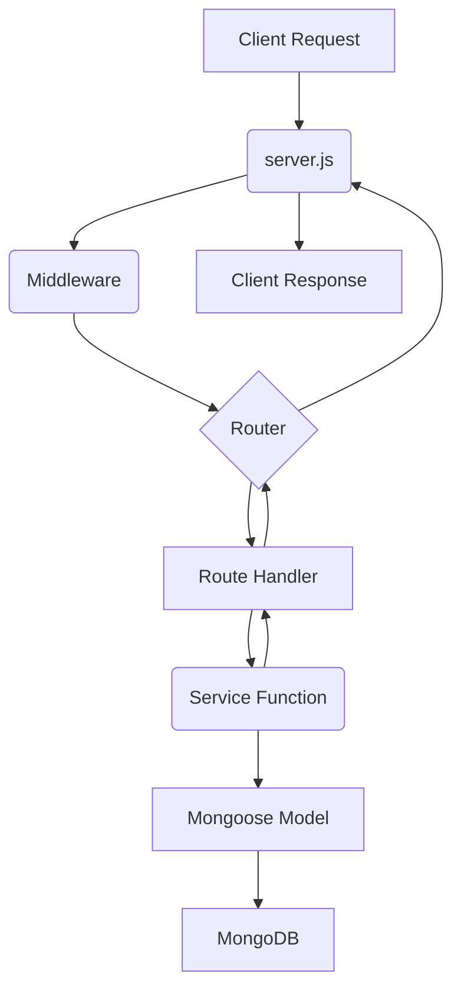

# Web Application Structural Improvements Plan

This document outlines potential structural improvements for the financial web application, based on an assessment of the current codebase and common software architecture patterns.

## Current Structure Assessment

The application currently follows a standard full-stack structure with a clear separation between the frontend (`client/`) and backend (`server/`).

*   **Backend (`server/`):** Organizes code into directories for routes (`server/routes`), Mongoose models (`server/models`), and the main server entry point (`server/server.js`).
*   **Frontend (`client/`):** Uses React components and pages within `client/src/`.

This structure is clear and maintainable for the current size of the application.

## Proposed Structural Improvements

As the application grows, the following areas could be enhanced for better scalability, maintainability, and testability:

### 1. Backend Service Layer

*   **Issue:** Business logic is often mixed with route handling logic in `server/routes`. This can lead to code duplication and make route handlers complex.
*   **Suggestion:** Introduce a service layer by creating a `server/services` directory. Each service file (e.g., `server/services/transactionService.js`, `server/services/budgetService.js`) will encapsulate specific business operations. Route handlers will become thinner, primarily responsible for parsing requests, calling service functions, and formatting responses.
*   **Benefit:** Improves separation of concerns, promotes reusability of business logic, simplifies route handlers, and facilitates unit testing of core logic.

### 2. Frontend State Management

*   **Issue:** Managing shared state across a growing number of React components using only `useState` and the Context API can become cumbersome, potentially leading to prop drilling or scattered state logic.
*   **Suggestion:** As the application's state complexity increases, consider adopting a dedicated state management library (e.g., Zustand, Recoil, Jotai, or Redux).
*   **Benefit:** Provides a centralized, predictable, and debuggable way to manage application state, simplifying data flow in larger applications.

### 3. Configuration Management

*   **Issue:** Configuration values from `.env` files might be accessed directly in various parts of the application, making it harder to manage and validate settings.
*   **Suggestion:** Centralize configuration loading and access. Create a dedicated configuration module (e.g., `server/config/index.js`) that loads environment variables and provides structured access to configuration settings. Libraries like `dotenv-safe` or `convict` can be used for validation and schema definition.
*   **Benefit:** Creates a single source of truth for configuration, simplifies environment management, and allows for configuration validation.

### 4. Error Handling

*   **Issue:** Error handling might be inconsistent across different parts of the application, potentially leading to unhandled exceptions or inconsistent error responses to the client.
*   **Suggestion:** Implement centralized error handling. On the backend, use middleware to catch errors and send consistent, informative error responses. On the frontend, establish patterns for handling API errors gracefully and displaying user-friendly messages.
*   **Benefit:** Ensures consistent error reporting, improves robustness, and enhances the developer and user experience.

### 5. Testing Strategy

*   **Issue:** Lack of automated tests makes it difficult to verify code correctness and prevent regressions when making changes.
*   **Suggestion:** Introduce automated testing. Implement unit tests for individual functions/components and integration tests for interactions between modules. Use appropriate testing frameworks (e.g., Jest, React Testing Library). Organize tests logically, perhaps in `__tests__` directories or a dedicated `test/` folder.
*   **Benefit:** Increases confidence in the codebase, facilitates safe refactoring, and helps catch bugs early.

### 6. Code Style and Linting

*   **Issue:** Inconsistent code style can reduce readability and maintainability.
*   **Suggestion:** Configure and use linters (like ESLint) and code formatters (like Prettier) to enforce a consistent code style across the project. Integrate these tools into the development workflow (e.g., editor extensions, pre-commit hooks).
*   **Benefit:** Improves code readability, reduces style-related conflicts, and helps maintain a professional codebase.

## Visualizing Backend Structure (with Service Layer)

This diagram illustrates how a request flows through the backend with the addition of a service layer.